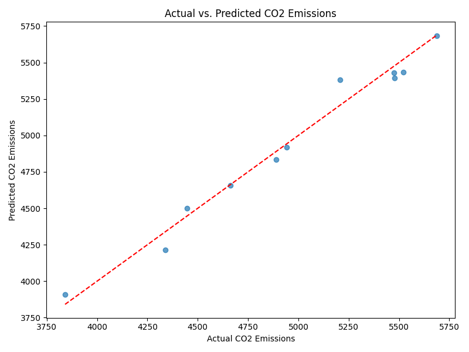
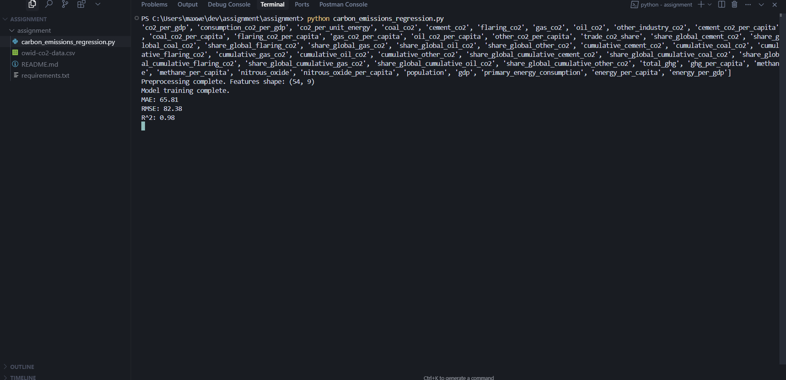

# SDG 13: Climate Action - Predicting CO2 Emissions with Machine Learning

## Introduction
This project uses machine learning to predict annual CO2 emissions for a selected country, supporting the UN Sustainable Development Goal 13: Climate Action. By forecasting emissions, we can help policymakers and researchers plan effective interventions for a sustainable future.

## Dataset
- **Source:** [Our World in Data - CO2 and Greenhouse Gas Emissions](https://www.kaggle.com/datasets/danielbeltschneider/co2-and-greenhouse-gas-emissions)
- **File:** `owid-co2-data.csv`

## Machine Learning Approach
- **Type:** Supervised Learning (Regression)
- **Algorithm:** Random Forest Regressor
- **Features:** Year, GDP, Population, Energy per Capita, Primary Energy Consumption, CO2 per Capita, Coal CO2, Oil CO2, Gas CO2
- **Target:** CO2 Emissions

## Usage
1. Install dependencies:
   ```bash
   pip install pandas numpy scikit-learn matplotlib seaborn
   ```
2. Run the script:
   ```bash
   python carbon_emissions_regression.py
   ```
3. Follow the prompts and view the output plots.

## Results
- The improved model uses a Random Forest Regressor and a richer set of features, resulting in significantly better predictive performance.
- **Evaluation Metrics:**
  - MAE: 65.81
  - RMSE: 82.38
  - R²: 0.98
- The model explains 98% of the variance in the actual CO₂ emissions data for the United States, with low average errors. This demonstrates excellent predictive power for annual CO₂ emissions.

## Pitch Deck
You can view the project presentation here: [Google Slides Pitch Deck](https://docs.google.com/presentation/d/1XetfYiMgLJNN3Zl5cPglkp68eqL8VKqjYGi--QZ7qKI/edit?usp=sharing)

## Ethical Reflection
- Consider potential biases in the data (e.g., missing years, country reporting differences).
- How could this model be used for climate action?
- How can you ensure fairness and promote sustainability?

## Screenshots

### Model Results Plot


### Terminal Output

